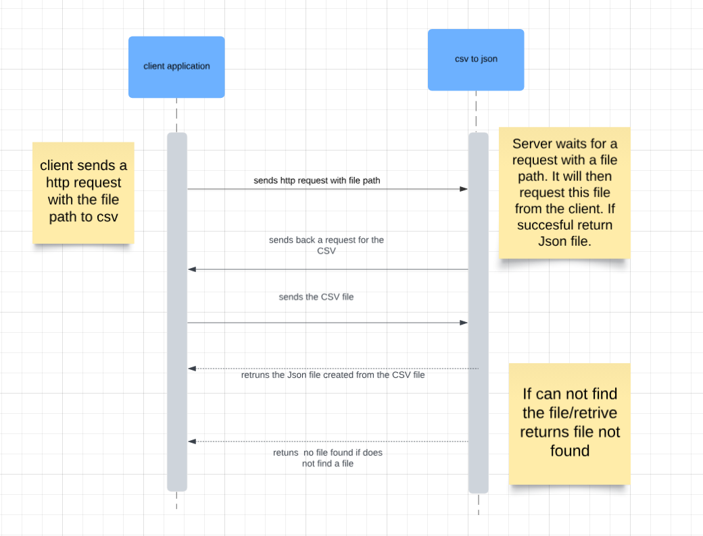

# CSV to JSON Microservice


## Overview

This service converts uploaded CSV files to JSON format. It is implemented using Flask and provides a simple API to handle file uploads and receive JSON data.

## Run Locally 
If you need to run the service locally you will need to install flask

```
pip install Flask
```

## HTTP Communcation 
To request data from the service, you need to POST a CSV file path to the /convert endpoint. The server will return a JSON file. It is up to the user to decide what to do with the response.

```
POST URL/convert -F "file path"
```


## Example Request 
This example creates a request function that gets the JSON file from the service. Then once it retrives it saves JSON file in specifed location in the 2nd argument.

```
import requests

def make_request_CSV_to_JSON(file_path, save_path):
    url = "http://localhost:4000/convert"
    files = {'file': open(file_path, 'rb')}

    response = requests.post(url, files=files)

    if response.status_code == 200:
        with open(save_path, 'wb') as f:
            f.write(response.content)
        print(f"Request successful! JSON file saved as '{save_path}'.")
    elif response.status_code == 400:
        print("Error:", response.json()['error'])
    else:
        print("An error occurred:", response.status_code, response.text)

make_request_CSV_to_JSON("CSVs/trainees.csv", "JSONS/trainees.json")
```
### Second example
Here we just send the file path to the service location. 

```
curl -X POST http://localhost:4000/convert \ -F "file=@/path/to/your/file.csv"
```

## Receiving Data from the Microservice

Appon successful processing, the service returns the JSON representation of the CSV data. If you use example code for a request the JSON will be saved in the specified path.

### Example Response 
```
[
    {
    "header1": "value1", 
    "header2": "value2"
    },
    {
    "header1": "value3", 
    "header2": "value4"
    }
]
```

# UML Diagram



### Quick Start Guide
Create a function that has service URL file path, and save path. You can then call the function when you need to convert a CSV to a JSON file.
```
import requests

def make_request_CSV_to_JSON(file_path, save_path):
    url = "http://localhost:4000/convert"
    files = {'file': open(file_path, 'rb')}

    response = requests.post(url, files=files)

    if response.status_code == 200:
        with open(save_path, 'wb') as f:
            f.write(response.content)
        print(f"Request successful! JSON file saved as '{save_path}'.")
    elif response.status_code == 400:
        print("Error:", response.json()['error'])
    else:
        print("An error occurred:", response.status_code, response.text)

make_request_CSV_to_JSON("CSVs/trainees.csv", "JSONS/trainees.json")
```


### communication contract

4.a 
question:  Stated the teammate for whom you implemented "Microservice A"
answer : Christopher Bremseth

4.b
Clearly stated the current status of the microservice you are implementing / you implemented for your teammate.
Completed/fully working.

4.c. Clearly stated problems with the microservice you implemented and by when you'll fix them (if there are any problems)

The service has no issue I just removed all development code and debug so now runs it doesnt give this is a development build warning.

4.d. Clearly described how your teammate should go about accessing the microservice you implemented

The service has its code hosted on github. https://github.com/coneheadlarry/MicroserviceALinks to an external site.

 

4.e. Clearly stated what your teammate should do if they cannot access/call the microservice you implemented.
They can send me a message on discord and I will try and respond within 12 hours. If they can not accesses the code i can just send them the files directly.

 

4.f. Clearly stated by when your teammate needs to notify you of problems with the microservice you implemented
By friday or thursday works best so i can implement them before code review deadline.

4.g. Clearly stated anything else your teammate needs to know, if there is anything.
the service was made with love, JK. The service no longer has text files as means of communication. This was already communicated just has a post request with the file path that would have been in the text file.
