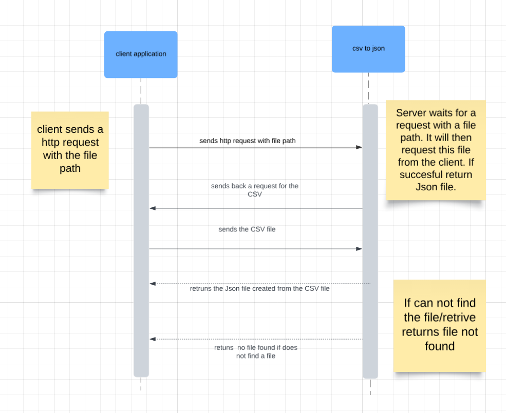

# CSV to JSON Microservice

#### Communication Contract
```
We will use Discord to communicate.
We are committed to a response time of 24 hours, with understanding that all of us have individual lives with competing priorities.
We should always be respectful to each other and assume positive intent
```

## Overview

This service converts uploaded CSV files to JSON format. It is implemented using Flask and provides a simple API to handle file uploads and receive JSON data.


## HTTP communcation 
To request data from the service, you need to POST a CSV file to the /convert endpoint.

```
POST /convert
```


## Example Request 
This example creates a request function that gets the JSON file from the service then saves it in a specifed location.

```
import requests

def make_request_CSV_to_JSON(file_path, save_path):
    url = "http://localhost:5000/convert"
    files = {'file': open(file_path, 'rb')}

    response = requests.post(url, files=files)

    if response.status_code == 200:
        with open(save_path, 'wb') as f:
            f.write(response.content)
        print(f"Request successful! JSON file saved as '{save_path}'.")
    elif response.status_code == 400:
        print("Error:", response.json()['error'])
    else:
        print("An error occurred:", response.status_code, response.text)

make_request_CSV_to_JSON("CSVs/trainees.csv", "JSONS/trainees.json")
```
### or 

```
curl -X POST http://localhost:5000/convert \ -F "file=@/path/to/your/file.csv"
```

## Receiving Data from the Microservice

Appon successful processing, the service returns the JSON representation of the CSV data.

### Example Response 
```
[
    {
    "header1": "value1", 
    "header2": "value2"
    },
    {
    "header1": "value3", 
    "header2": "value4"
    }
]
```

# UML Diagram



### Quick Start Guide
Create a function that has service URL file path, and save path. You can then call the function when you need to convert a CSV to a JSON file.
```
import requests

def make_request_CSV_to_JSON(file_path, save_path):
    url = "http://localhost:5000/convert"
    files = {'file': open(file_path, 'rb')}

    response = requests.post(url, files=files)

    if response.status_code == 200:
        with open(save_path, 'wb') as f:
            f.write(response.content)
        print(f"Request successful! JSON file saved as '{save_path}'.")
    elif response.status_code == 400:
        print("Error:", response.json()['error'])
    else:
        print("An error occurred:", response.status_code, response.text)

make_request_CSV_to_JSON("CSVs/trainees.csv", "JSONS/trainees.json")
```
